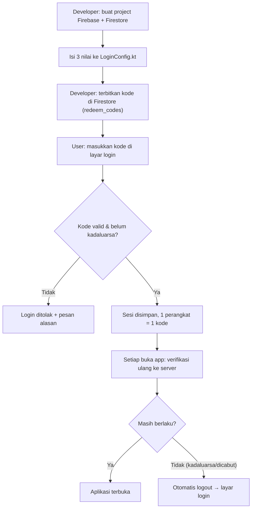

# 🔐 Panduan Aktivasi Fitur Login (Kode Redeem)

Panduan langkah-demi-langkah untuk **developer** mengaktifkan fitur login aplikasi
**Scalping AI Assistant**. Pengguna baru masuk dengan **kode redeem** yang Anda
terbitkan; masa berlaku kode diatur oleh Anda dan aplikasi akan **otomatis logout**
begitu kode kadaluarsa atau dicabut.

> [!NOTE]
> **Apakah perlu panel admin?** **Tidak.** Semua pengelolaan kode dilakukan langsung
> dari **Firebase Console** (gratis) — sama seperti mengedit tabel biasa. Anda tidak
> perlu membangun web admin. Untuk menerbitkan kode, gunakan generator di
> [`tools/redeem/`](tools/redeem/README.md).

---

## Ringkasan alur



---

## Bagian 1 — Membuat Firebase (sekali saja)

1. Buka [Firebase Console](https://console.firebase.google.com) dan login dengan akun Google.
2. Klik **Add project** → beri nama (mis. `scalping-assistant`) → lanjutkan.
   - Google Analytics boleh **dimatikan** (tidak dipakai aplikasi ini).
3. Setelah project jadi, klik ikon **Android** pada halaman **Project overview**
   untuk **Add app**:
   - **Android package name:** `com.scalping.assistant` — **harus persis**.
   - Nickname & SHA-1 boleh dikosongkan.
4. Firebase akan menawarkan file `google-services.json`.
   **👉 File ini TIDAK diperlukan** — jangan diunduh/dipasang. Tutup saja langkah itu
   (aplikasi ini memakai inisialisasi programatik, lihat Bagian 2).
5. Buka menu **Build → Firestore Database → Create database**:
   - Pilih lokasi server terdekat (mis. `asia-southeast2` / Jakarta).
   - Mulai dalam **mode produksi** (Production mode).
6. Masuk ke **Project settings (⚙️) → General → Your apps → SDK setup and configuration**.
   Catat **tiga nilai** berikut:

| Nilai di Firebase | Contoh |
|-------------------|--------|
| **Project ID** | `scalping-assistant-a1b2c` |
| **App ID** | `1:1234567890:android:1a2b3c4d5e6f7g8h` |
| **Web API Key** | `AIzaSy................` |

---

## Bagian 2 — Mengisi konfigurasi di aplikasi

Buka [`LoginConfig.kt`](app/src/main/java/com/scalping/assistant/data/auth/LoginConfig.kt)
dan isi ketiga nilai dari langkah sebelumnya:

```kotlin
const val PROJECT_ID = "scalping-assistant-a1b2c"
const val APPLICATION_ID = "1:1234567890:android:1a2b3c4d5e6f7g8h"
const val API_KEY = "AIzaSy................"
```

Simpan, lalu build ulang APK (`.\gradlew assembleDebug`).

> [!IMPORTANT]
> Selama `PROJECT_ID` masih kosong, aplikasi berjalan dalam **MODE PENGEMBANGAN**:
> layar login **dilewati** sepenuhnya. Ini disengaja agar build & pengujian fitur lain
> tidak terhambat. Fitur login baru aktif setelah ketiga nilai diisi.

---

## Bagian 3 — Security Rules (WAJIB)

Firestore → tab **Rules**. Ganti seluruh isi dengan aturan berikut, lalu **Publish**:

```
rules_version = '2';
service cloud.firestore {
  match /databases/{database}/documents {

    // Pengguna boleh MEMBACA kode (untuk verifikasi), tapi TIDAK boleh menulis.
    // Penulisan kode dilakukan dari Console / generator saja.
    match /redeem_codes/{code} {
      allow read: if true;
      allow write: if false;
    }

    // Catatan aktivasi perangkat: diisi dari Console (lihat catatan di bawah).
    match /activations/{deviceId} {
      allow read, write: if false;
    }
  }
}
```

> [!WARNING]
> **Kenapa `write: if false` penting?** Kunci API di dalam aplikasi Android bukan
> rahasia (memang begitu desain Firebase). Yang melindungi data Anda adalah Rules ini.
> Tanpa Rules, siapa pun bisa mengubah/menghapus kode redeem Anda.

### Konsekuensi: `deviceId` tidak terisi otomatis

Dengan Rules di atas, aplikasi **tidak bisa** menulis `deviceId` ke dokumen kode.
Artinya pengikatan "1 kode = 1 perangkat" **tidak dipaksakan server**.

Pilih salah satu:

| Opsi | Cara kerja | Keamanan | Usaha |
|------|-----------|----------|-------|
| **A. Manual (disarankan)** | Setelah kode diaktifkan, periksa dokumennya, lalu isi `deviceId` dari Console. Kode yang punya `deviceId` tidak bisa dipakai di HP lain. | Sedang | 1 kali edit per pembeli |
| **B. Aktifkan tulis** | Ubah Rules `activations` → `allow write: if true;` dan `redeem_codes` → `allow write: if request.resource.data.diff(resource.data).affectedKeys().hasOnly(['deviceId','activatedAt','activationCount']);` | Otomatis | Sekali set |

Opsi **B** membuat aplikasi otomatis menulis `deviceId` saat aktivasi pertama
(seperti dijelaskan di [`LoginRepository`](app/src/main/java/com/scalping/assistant/data/auth/LoginRepository.kt)),
sehingga "1 kode = 1 perangkat" langsung berlaku tanpa Anda menyentuh Console.

---

## Bagian 4 — Menerbitkan kode redeem

Gunakan generator (lihat [`tools/redeem/README.md`](tools/redeem/README.md)):

```bash
cd tools/redeem
node generate-code.js --days 30 --note "Budi - paket 1 bulan"
```

Perintah itu mencetak **kode** + **JSON dokumen Firestore** siap tempel. Masukkan ke
Firestore sebagai berikut:

1. Firestore Database → **Data** → **Start collection** → ID: `redeem_codes`.
2. **Add document** → **Document ID** = kode Anda (mis. `SCLP7K2M9QX4`).
3. Tambahkan field:

   | Field | Tipe | Nilai |
   |-------|------|-------|
   | `active` | boolean | `true` |
   | `expiresAt` | number | epoch millis, mis. `1767225600000` |
   | `note` | string | mis. `Budi - paket 1 bulan` |
   | `createdAt` | number | epoch millis saat dibuat |

4. **Save**.

> [!TIP]
> Aplikasi menerima `expiresAt` sebagai **number** (disarankan) **maupun** sebagai
> **timestamp** lewat pemilih tipe di Console — keduanya bisa dibaca.

---

## Bagian 5 — Pengelolaan harian

Semua tindakan di bawah dilakukan dari **Firestore Console** (tanpa panel admin):

| Ingin… | Lakukan |
|--------|---------|
| **Cabut kode** (user langsung terlogout saat buka app) | Ubah `active` → `false` |
| **Perpanjang** masa berlaku | Ubah `expiresAt` ke epoch millis baru |
| **Perpendek** masa berlaku | Ubah `expiresAt` ke nilai lebih kecil |
| **Pindah perangkat** (user ganti HP) | Hapus field `deviceId` pada dokumen kode |
| **Lihat siapa di perangkat mana** | Periksa field `deviceId` pada dokumen kode |
| **Terbitkan kode ke-2…ke-n** | Ulangi Bagian 4 (tiap dokumen = 1 kode) |

Satu kode = satu pengguna/perangkat. Untuk pelanggan baru, terbitkan kode baru.

---

## Bagian 6 — Apa yang dilihat pengguna

| Keadaan | Perilaku aplikasi |
|---------|-------------------|
| Belum login | Muncul **layar login** `🔑 Masukkan Kode Redeem` |
| Kode benar & berlaku | Masuk ke aplikasi; sesi tersimpan |
| Kode salah ketik | “Kode redeem tidak ditemukan.” + input bergetar |
| Kode kadaluarsa | “Kode redeem sudah kadaluarsa pada …” |
| Kode dicabut | “Kode redeem ini sudah dinonaktifkan.” |
| Kode dipakai di HP lain | “Kode ini sudah diaktifkan di perangkat lain.” |
| **Fitur login belum diaktifkan** | Login dilewati (MODE PENGEMBANGAN) |
| Kode kadaluarsa **saat app terbuka** | Otomatis logout → kembali ke layar login |
| Jam HP dimundurkan (curang) | Login ditolak: “Waktu perangkat terdeteksi mundur…” |
| Tidak ada internet | Sesi terakhir tetap dipakai **selama belum kadaluarsa**; begitu server terjangkau, keputusan server berlaku |

### Keluar akun manual

Di layar utama, **tekan lama** pada lencana sesi (badge fase pasar, kiri atas) →
dialog **Keluar Akun** muncul → pilih **Keluar** untuk kembali ke layar login.

---

## Bagian 7 — Mode pengembangan (bypass)

Agar build & pengujian tidak terhambat, login **otomatis dilewati** bila
`LoginConfig.PROJECT_ID` kosong. Tidak ada perubahan lain yang diperlukan: cukup
kosongkan kembali `PROJECT_ID` untuk kembali ke mode pengembangan.

---

## Butuh bantuan?

- **Model data Firestore** & catatan keamanan: lihat KDoc di
  [`LoginRepository.kt`](app/src/main/java/com/scalping/assistant/data/auth/LoginRepository.kt).
- **Konstanta konfigurasi:** [`LoginConfig.kt`](app/src/main/java/com/scalping/assistant/data/auth/LoginConfig.kt).
- **Alat penerbit kode:** [`tools/redeem/`](tools/redeem/README.md).
